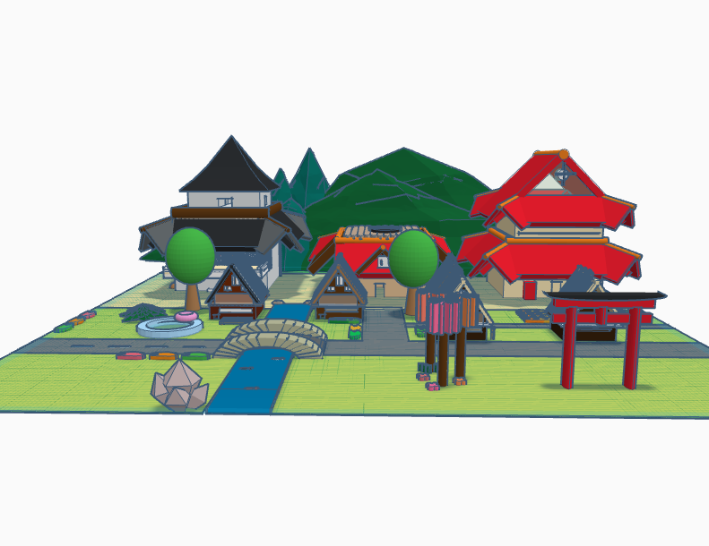
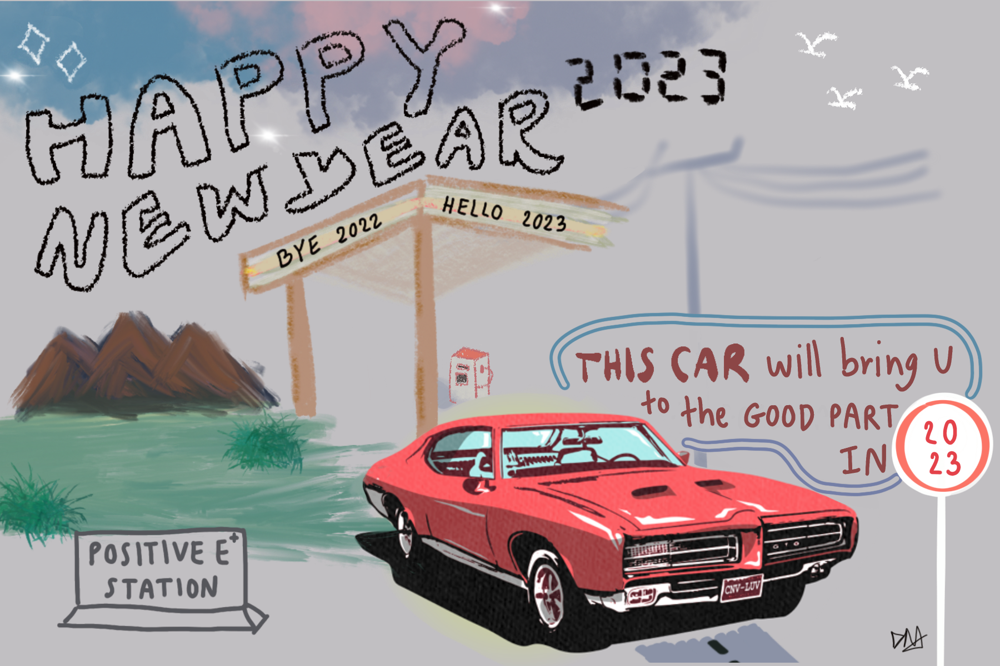
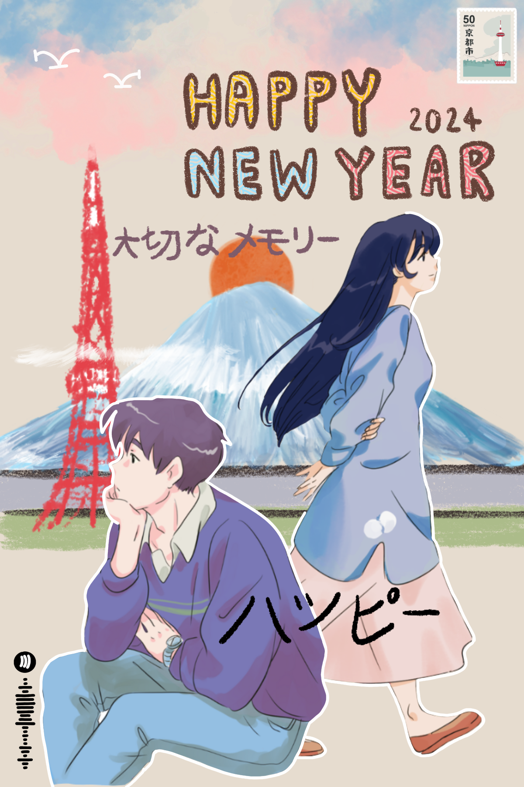

# ✍️ Graphic skills

## 3D เมืองญี่ปุ่นจำลอง

<figure><figcaption></figcaption></figure>


ต้อง login/sign-up account ก่อนเข้า 🙏



vdo งานคร่าวๆ (เผื่อกรณีเข้าชมผ่าน web ไม่ได้)


***

## ส.ค.ส. 2023-2024

<figure><figcaption>
2023
</figcaption></figure>

 

<figure><figcaption>
2024
</figcaption></figure>

ออกแบบ ส.ค.ส. โดยใช้ “ProCreate”

* 2023 - Fixed: รถ จึงออกแบบ concept เป็นการเดินทางไปพบสิ่งใหม่ ๆ ในปีหน้า และใส่ความรู้สึก old town เข้าไปเล็กน้อย โดยเลือกใช้สีที่ตัดกับสี bg และต้องระวังของจำกัดของสี ตอน print ออกมาเป็น postcard
* 2024 - Fixed: ผู้หญิง&ผู้ชาย จึงออกแบบ concept ให้มีความญี่ปุ่น! ทำให้เลือก ภูเขาไฟฟูจิ และ Tokyo tower มาใส่ + ท้องฟ้าที่สดใส พร้อมรับปีใหม่ และมีความ dreamy ที่ทำให้นึกถึง anime ด้วย

<figure><figcaption>
2023
</figcaption></figure>

 

<figure><figcaption>
2024
</figcaption></figure>

## Poster ท่องเที่ยวไทย

<figure><figcaption>
ออกแบบโดยใช้ procreate
</figcaption></figure>

โจทย์ของงานนี้คือ ออกแบบ poster เชิญชวนท่องเที่ยวไทย จึงทำให้คิดว่า ควรนำสถานที่ที่เป็นจุดเด่นของแต่ละจังหวัดมาแนะนำใน poster โดยให้มีความ smooth และรวมอยู่ในใบเดียวกันได้ เลยเลือกโทนสีที่ใกล้เคียงกันในภาพที่ติดกัน ส่วนบางภาพก็เลือกให้สีตัดกันไปเลย แต่อาจเพิ่มลวดลายให้ภาพดูเข้ากันได้ และยังได้แต่งกลอนเชิญชวนให้คนสนใจมาท่องเที่ยวอีกด้วย
