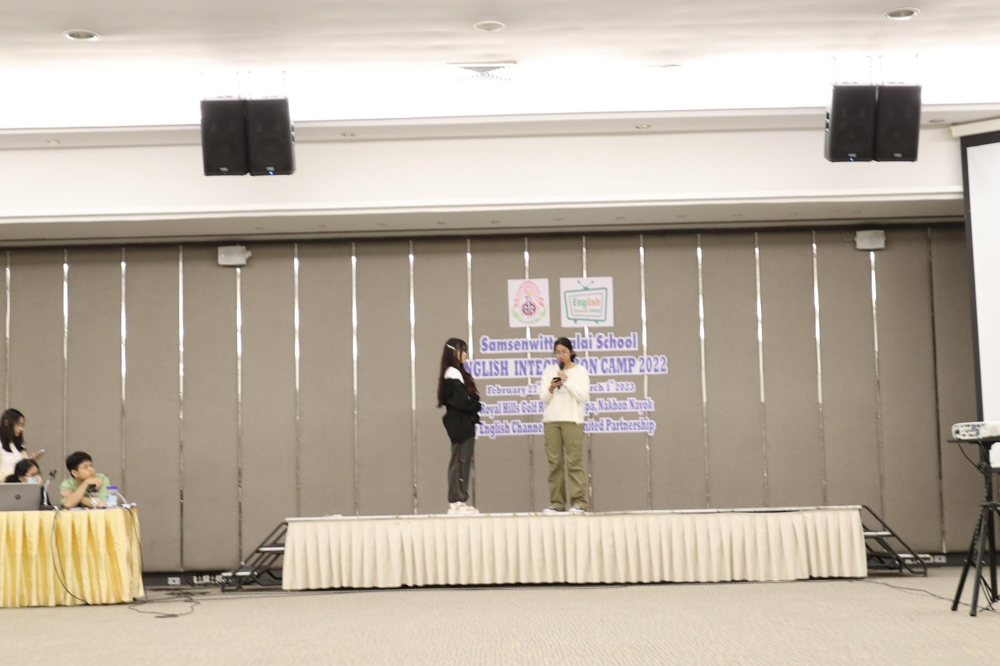

---
layout:
  title:
    visible: true
  description:
    visible: false
  tableOfContents:
    visible: true
  outline:
    visible: true
  pagination:
    visible: true
---

# 🪄 Sound controller

> ประสบการณ์ทำ sounds ประกอบการแสดง โดยมีโอกาสออกแบบทั้ง scenes เพลง และ sound effects

## School role playing (Thai subject)

"การแสดง role playing เรื่อง True Beauty พากย์อีสาน"

<figure><figcaption>
ทีมแสดง + การแบ่งบท
</figcaption></figure>

เป็นการทำ + คุม Sounds ในการแสดงครั้งแรก จึงได้นำทักษะต่าง ๆ มาใช้ และได้รับโอกาสในการพัฒนาหลาย ๆ ส่วน

* เป็นหัวหน้ากลุ่มในการออกแบบและเลือก Scenes ที่น่าสนใจ
* ได้เป็น Acting coach ในการ brief characters ของแต่ละตัวละคร
* มีส่วนร่วมในการแปลงบทเป็นพากย์อีสาน
* "ออกแบบ Sounds ใหม่ ที่จะเปิดในแต่ละช่วง โดยใช้ Garage Band" + เลือกบาง Scores จากในเรื่องมาใช้&#x20;
* ร่วมแสดงในบท ซอจุน และ "ควบคุมการเปิด-ปิด Sounds ทั้งหมด"

<figure><figcaption>
Timeline ในการเปิด-ปิด Sounds แต่ละช่วง
</figcaption></figure>

***

## EP Samsen I English-Camp 2023-1

"การแสดงใน English Camp จาก concept เพลง Ditto - NewJeans"

<figure><figcaption></figcaption></figure>

 

<figure><figcaption></figcaption></figure>

* เป็นงานที่"มีเวลาเตรียมตัวเพียง 4-5 ชม." จึงทำให้"ได้ประสบการณ์ในการทำงานที่อยู่ภายใต้ความกดดัน" อีกทั้งยังเป็นการทำงานใน scale ที่ใหญ่ขึ้น และได้"ฝึกทักษะการทำงานร่วมกับผู้อื่น"มากขึ้นด้วย
* Brief ที่ได้มา เป็นเพียงฉากคร่าว ๆ จึง"ได้ฝึกทักษะ Show designing" และเลือก Sound effects ที่ควรจะใช้ในแต่ละช่วง + "Rearrange" เพลงในบางช่วง
* เป็นคนคุมเปิด-ปิด Sounds ทั้งหมด โดยงานนี้มีโอกาส "Run through ก่อนแสดงจริงเพียง 5-10 นาที" ทำให้"ได้ฝึกแก้ปัญหาเฉพาะหน้า"และรับมือกับความกดดัน ขณะทำการแสดงจริง

